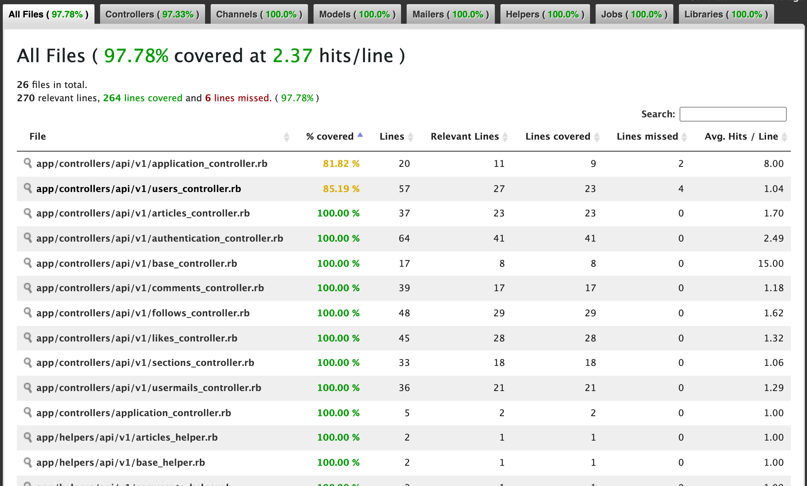
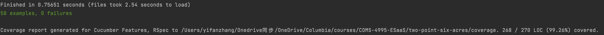
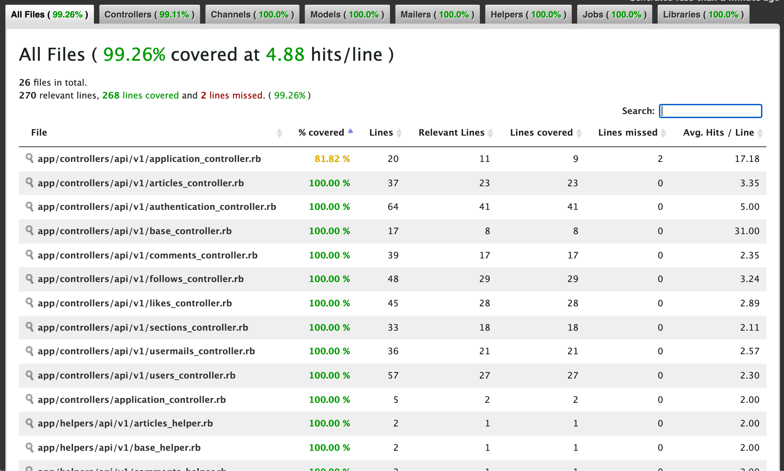

# Two-Point-Six-Acres

A Forum Specially Designed for Foreign Students in the U.S.

## Collaborators

| Name         | UNI    |
| ------------ | ------ |
| Tianyou Song | ts3347 |
| Wenye Ma     | wm2454 |
| Xiaofan Wang | xw2741 |
| Yifan Zhang  | yz3959 |


## How to Start

### Backend:

Install gems:
```shell
bundle install  
# If there is any update
# Use bundle update
```

Data migration:
```shell
bundle exe rake db:migrate
```

Add seeds data:
```shell
bundle exe rake db:seed
```

Check routes:
```shell
bundle exe rake routes
```

Start the server:
```shell
bundle exe rails s
```

Check API using curl:
```shell
curl -i http://localhost:3000/api/v1/articles/1.json
# You have to add .json postfix
```

### Frontend:

#### Before Run
- Clone or download this repository
- Enter your local directory, and install dependencies:

``` bash
npm install
```

#### Run
``` bash
# serve with hot reload at localhost:8010
npm run dev
```


## Test

### Cucumber

Before running cucumber tests, run the following command to clear the seed data from the database,
otherwise the background step of articles.feature would fail:
```shell
rake db:reset
```

Run all cucumber tests:
```shell
rake cucumber
```

Cucumber test coverage:



### Rspec

Before running rspec tests, run the following command to populate the test database with seed data:
```shell
rake db:seed RAILS_ENV=test
```

Run all rspec tests:
```shell
rake spec
```

Rspec test coverage:



## Deployment

## GitHub Repo Link
Github Link(frontend): https://github.com/Ruby-Newbies/2point6acres-frontend

Github Link(backend): https://github.com/Ruby-Newbies/two-point-six-acres

## Deployment Link
Heroku endpoint (frontend): https://rocky-retreat-55161.herokuapp.com/#/articles

Heroku endpoint (backend):  https://mysterious-gorge-21193.herokuapp.com

## Features

As users of 2 point 6 acres, currently they can enjoy following features:

### Features regarding users
1. As new users, they can register with username, email, and password.
2. Users can login with their own account by username and password.
3. Users will have protected rest APIs if they have logged in.

### Features regarding articles

1. User can retrieve all articles or just retrieve an article by its id.
2. User can express my latest idea and correct mistakes so I want to update my article.
3. User can also delete certain article.
4. User can also create a new article.

### Features regarding comments

1. User can retrieve all comments or just retrieve a comment by its author_id.
2. User can add a comment to certain article to make discussion.
3. User can avoid outdated comment and mistakes to affect others by deleting my comment.

