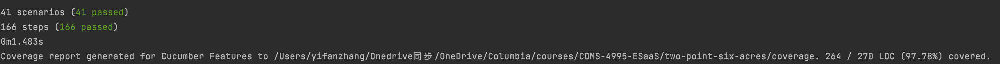

# Two-Point-Six-Acres

A Forum Specially Designed for Foreign Students in the U.S.

## Collaborators

| Name         | UNI    |
| ------------ | ------ |
| Tianyou Song | ts3347 |
| Wenye Ma     | wm2454 |
| Xiaofan Wang | xw2741 |
| Yifan Zhang  | yz3959 |


## How to Start

### Backend:

Install gems:
```shell
bundle install  
# If there is any update
# Use bundle update
```

Data migration:
```shell
bundle exe rake db:migrate
```

Add seeds data:
```shell
bundle exe rake db:seed
```

Check routes:
```shell
bundle exe rake routes
```

Start the server:
```shell
bundle exe rails s
```

Check API using curl:
```shell
curl -i http://localhost:3000/api/v1/articles/1.json
# You have to add .json postfix
```

### Frontend:

#### Before Run
- Clone or download this repository
- Enter your local directory, and install dependencies:

``` bash
npm install
```

#### Run
``` bash
# serve with hot reload at localhost:8010
npm run dev
```


## Test

### Cucumber

Before running cucumber tests, run the following command to clear the seed data from the database,
otherwise the background step of articles.feature would fail:
```shell
rake db:reset
rake db:migrate
rake db:seed
```

Run all cucumber tests:
```shell
rake cucumber
```

Cucumber test coverage:



### Rspec

Before running rspec tests, run the following command to populate the test database with seed data:
```shell
rake db:reset
rake db:migrate
rake db:seed RAILS_ENV=test
```

Run all rspec tests:
```shell
rake spec
```

Rspec test coverage:


## GitHub Repo Link
Github Link(frontend): https://github.com/Ruby-Newbies/2point6acres-frontend

Github Link(backend): https://github.com/Ruby-Newbies/two-point-six-acres

## Deployment Link
Heroku endpoint: https://rocky-retreat-55161.herokuapp.com/#/

The admin console URL is: https://rocky-retreat-55161.herokuapp.com/#/admin

## Available Test Account
email: studentA@columbia.edu
password: 123123

## Features

As users of 2 point 6 acres, currently they can enjoy following features:

### Features regarding users
1. As new users, they can register with username, email, and password.
2. Users can login with their own accounts with username and password.
3. Users will have protected rest APIs if they have logged in.
4. Normal users can manage articles of themselves.
5. User registration checks whether the email has .edu suffix. If not, return 400.

### Features regarding authentication

1. Almost all REST APIs now requires user authentication. If the user is not logged in, visiting the protected APIs returns 401.

### Features regarding admin users
1. Valid admin users can login to specific admin web page.
2. Admin users can manage all sections, articles and other users.
3. A separate frontend admin console /admin.

### Features regarding sections
1. Articles belongs to several sections.
2. Articles can be filtered according to sections.

### Features regarding articles

1. Users can retrieve all articles or retrieve only one article by specifying article id.
2. List articles API supports pagination and filtering by author id and section id.
3. Users can create new articles.
4. Users can delete a specified article.
5. Users can express latest idea and correct mistakes by updating existing articles.
6. Articles contents now support markdown syntax.

### Features regarding comments

1. Users can retrieve all comments or only one comment by specifying comment id.
2. Users can retrieve comments of a specific article.
3. Users can add a comment to certain article to make discussion.
4. Users can avoid outdated comment and mistakes to affect others by deleting existing comments.

### Features regarding follows

1. Users can retrieve all their followers and following users.
2. Users can follow/unfollow a specific user.

### Features regarding likes

1. Users can like/dislike an article.
2. Users can see how many users liked/disliked a specific article.
3. Users can see whether they have already liked/disliked an article.

### Features regarding mails

1. Users can retrieve all mails they received or just retrieve a mail by its id.
2. Users can send a mail to a certain user.
3. After reading the mail, the status will become 1 from 0.